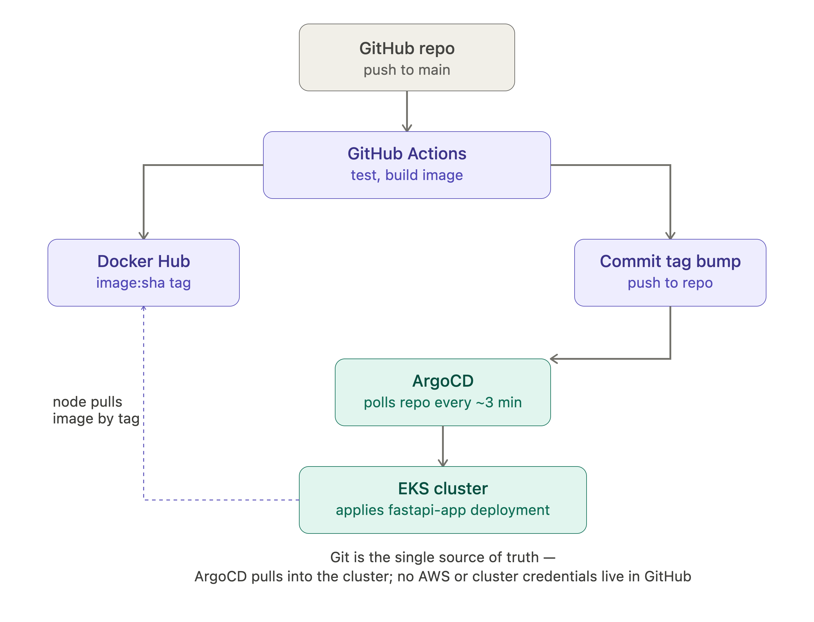
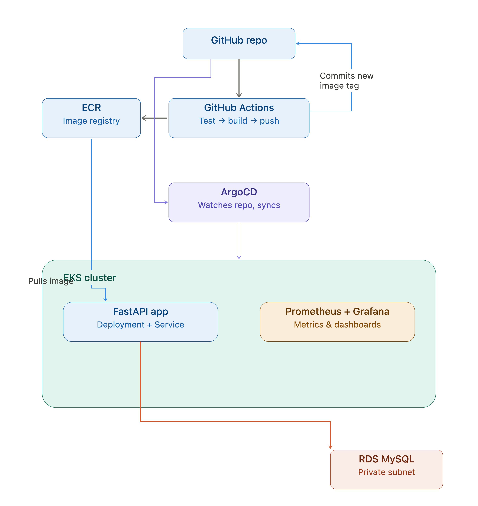
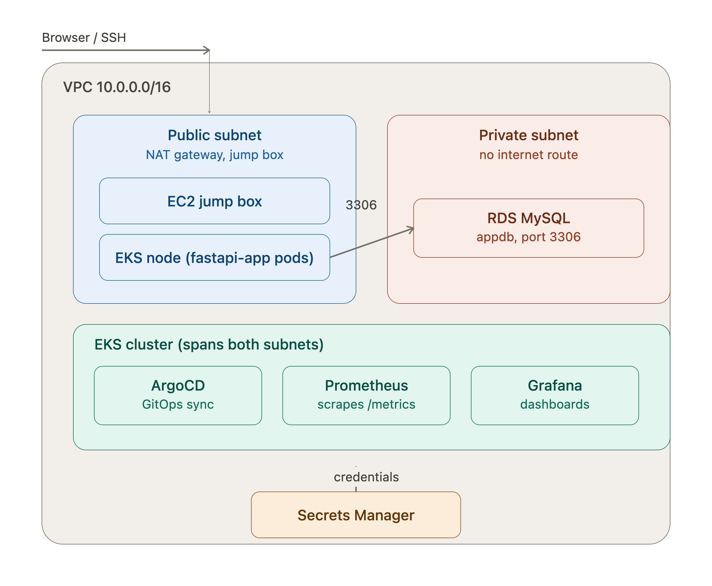

# FastAPI + MySQL on EKS

A production-grade FastAPI application with a built-in UI for querying a MySQL database. The app runs on **AWS EKS**, backed by **AWS RDS MySQL**, deployed automatically via **ArgoCD** (GitOps) and **GitHub Actions** (CI/CD). Prometheus + Grafana observability is planned for Phase 6.

> **Current status:** Phase 0–5 complete and running end-to-end. CI pushes images to Docker Hub, ArgoCD syncs to EKS, and the app queries RDS MySQL in production.

---

## Architecture





```
GitHub repo (app/ k8s/ argocd/)
        │ push to main
        ▼
GitHub Actions (CI)
  test → build → push image to Docker Hub
  → bump image tag in k8s/deployment.yaml → commit back to repo
        │ git commit
        ▼
ArgoCD (in-cluster, polls repo ~3 min)
        │ sync
        ▼
EKS Cluster
  ├── fastapi-app Deployment + ClusterIP Service ──► RDS MySQL (private subnet)
  └── (Phase 6) kube-prometheus-stack — Prometheus + Grafana
```

---

## AWS Infrastructure



| Resource | Detail |
|---|---|
| Region | `us-east-1` |
| VPC | `fastapi-eks-vpc` — `10.0.0.0/16`, 2 AZs, 2 public + 2 private subnets, 1 NAT gateway |
| EKS Cluster | `fastapi-eks-cluster` — 1 node group (`t3.medium`), Kubernetes v1.35.4 |
| RDS | `fastapi-mysql-db` — MySQL 8.0, `db.t3.micro`, private subnet only, no public access |
| EC2 Jump Box | `fastapi-access-point` (Ubuntu) — same VPC, used for `kubectl` and `mysql-client` access |
| Image Registry | Docker Hub (`subash26288/fastapi-app`) |
| Secrets | AWS Secrets Manager (`fastapi/rds/mysql-credentials`) |

> Infra is provisioned manually via the AWS Console. Detailed settings are in `infra/NOTES.md`.

---

## Stack

| Layer | Technology |
|---|---|
| Application | FastAPI (Python 3.12) |
| Database | MySQL 8 (local: Docker Compose, prod: AWS RDS) |
| ORM | SQLAlchemy 2 (sync, pymysql driver) |
| Templating | Jinja2 |
| Metrics | prometheus-fastapi-instrumentator |
| Container | Docker (multi-stage, non-root) |
| Orchestration | AWS EKS |
| GitOps | ArgoCD (auto-sync + self-heal) |
| CI | GitHub Actions |
| Observability | Prometheus + Grafana — Phase 6, not yet deployed |

---

## Repository Structure

```
.
├── app/
│   ├── main.py               # FastAPI routes
│   ├── db.py                 # SQLAlchemy engine + session
│   ├── models.py             # User ORM model
│   ├── schemas.py            # Pydantic schemas
│   ├── queries.py            # Predefined, parametrized query functions
│   ├── seed.py               # Demo data inserted on first boot
│   ├── templates/
│   │   ├── index.html        # Query UI
│   │   ├── add_user.html     # Add user form
│   │   └── sql_console.html  # Raw SQL console (dev only)
│   ├── requirements.txt
│   ├── Dockerfile            # Multi-stage, non-root
│   └── tests/
│       ├── conftest.py       # SQLite in-memory fixtures
│       ├── test_health.py
│       └── test_queries.py
├── k8s/
│   ├── deployment.yaml       # Image tag bumped by CI on every push
│   └── service.yaml          # ClusterIP, port 80 → 8000
├── argocd/
│   └── application.yaml      # ArgoCD Application — auto-sync + self-heal
├── .github/workflows/
│   └── deploy.yml            # test → build → push → bump manifest → commit
├── infra/
│   └── NOTES.md              # Manual AWS console setup record
├── Images/                   # Architecture diagrams
├── docker-compose.yml
├── .env.example
└── README.md
```

---

## CI/CD Pipeline

**GitHub Actions** (`.github/workflows/deploy.yml`) triggers on every push to `main`:

1. Run `pytest` against SQLite in-memory — no live DB needed
2. Build Docker image
3. Push to Docker Hub tagged with `${{ github.sha }}` and `latest`
4. Patch the new image tag into `k8s/deployment.yaml` via `sed`
5. Commit and push the manifest change back to the repo

**ArgoCD** watches `k8s/` on `main` and syncs within ~3 minutes of any manifest change. `selfHeal: true` reverts any manual `kubectl` drift automatically.

> The CI workflow skips runs authored by `github-actions[bot]` to avoid infinite loops from the manifest bump commit.

---

## Local Development

### Prerequisites

- [Docker](https://docs.docker.com/get-docker/) and Docker Compose

### Quickstart

```bash
git clone https://github.com/subash2628/EKS_FastAPI.git
cd EKS_FastAPI

cp .env.example .env

docker-compose up --build
```

On first startup the database is created and seeded with ~25 demo users automatically.

### Endpoints

| Endpoint | Description |
|---|---|
| `http://localhost:8000/` | Query UI |
| `http://localhost:8000/users/add` | Add a new user |
| `http://localhost:8000/sql` | SQL console (dev only) |
| `http://localhost:8000/health` | Health check + DB connectivity |
| `http://localhost:8000/metrics` | Prometheus metrics |
| `http://localhost:8000/api/query` | JSON query API |

### Stop / reset

```bash
docker-compose down        # stop
docker-compose down -v     # stop and wipe DB volume
```

---

## Environment Variables

| Variable | Description | Default |
|---|---|---|
| `DB_HOST` | MySQL host | `db` |
| `DB_PORT` | MySQL port | `3306` |
| `DB_USER` | App DB user | `app` |
| `DB_PASSWORD` | App DB password | `changeme` |
| `DB_NAME` | Database name | `appdb` |
| `DB_ROOT_PASSWORD` | MySQL root password (Docker only) | `rootchangeme` |

Never commit a real `.env` — it is in `.gitignore`.

---

## Query API Reference

### `GET /api/query`

| Parameter | Type | Description |
|---|---|---|
| `filter_type` | string | `all` \| `status` \| `date_range` \| `country` \| `name_search` |
| `status` | string | `active` or `inactive` |
| `country` | string | Exact country name |
| `name_search` | string | Partial name (LIKE match) |
| `date_from` / `date_to` | ISO date | e.g. `2025-01-01` |
| `page` | integer | Default `1`, 20 rows per page |

```bash
curl "http://localhost:8000/api/query?filter_type=all"
curl "http://localhost:8000/api/query?filter_type=status&status=active"
curl "http://localhost:8000/api/query?filter_type=country&country=Japan"
curl "http://localhost:8000/api/query?filter_type=name_search&name_search=alice"
curl "http://localhost:8000/api/query?filter_type=date_range&date_from=2025-01-01&date_to=2025-03-31"
```

### `GET /health`

```json
{ "status": "ok", "db": true }
```

Returns `503` if the DB is unreachable.

### `GET /metrics`

Prometheus-formatted metrics, ready for scraping in Phase 6.

---

## Running Tests

Tests use SQLite in-memory — no Docker or live MySQL needed.

```bash
cd app
pip install -r requirements.txt
pytest tests/ -v
```

---

## Delivery Phases

| Phase | Status | Description |
|---|---|---|
| 0 | Complete | Local dev — FastAPI + MySQL via Docker Compose |
| 1 | Complete | AWS networking — VPC, subnets, NAT gateway, RDS MySQL |
| 2 | Complete | EKS cluster, node group, kubectl access, RDS connectivity verified |
| 3 | Complete | Manual deploy to EKS, app querying RDS end-to-end |
| 4 | Complete | ArgoCD installed, GitOps auto-sync + self-heal active |
| 5 | Complete | GitHub Actions CI — test → build → push → manifest bump → ArgoCD sync |
| 6 | Not started | Prometheus + Grafana (`kube-prometheus-stack`) via ArgoCD |
| 7 | Not started | Production hardening — TLS, HPA, network policies, IRSA, Multi-AZ RDS |

---

## Open Items

- [ ] Prometheus + Grafana deployment (Phase 6)
- [ ] `ServiceMonitor` for FastAPI `/metrics` endpoint
- [ ] Expose app externally via Ingress + AWS Load Balancer Controller (currently ClusterIP only)
- [ ] IAM OIDC / IRSA for pod-level AWS auth (may be restricted in current lab account)
- [ ] Dedicated least-privilege MySQL app user (currently using RDS `admin`)
- [ ] RDS master password rotation
- [ ] EBS CSI driver, metrics-server
- [ ] TLS, RDS Multi-AZ, HPA, network policies (Phase 7)
